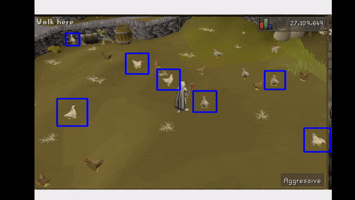
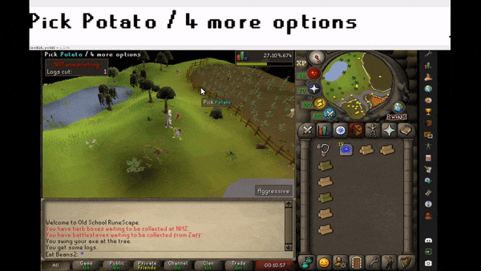

# Overview

This is a collection of tools which attempt to parse a live video feed of Old School Runescape into actionable intelligence using image processing techniques as well as some object recognition and template matching.

These scripts aim to demonstrate how relatively simple techniques can be used to assist or automate nontrivial processes such as playing a video game.

There are a few scripts which you can run that demo the various features. I will detail them below. Each of them have settings in config.yaml that will need to be tweaked.

# Scripts You Can Run

## run_classifier_live.py

Runs an object classifier (Haar cascade) on Runescape and highlights the detected objects. This repo includes two trained cascades. One detects trees, and the other detects chickens.

## parse_tooltip_live.py

Extracts the tooltip in the top left of the screen and attempts to parse it using optical character recognition. Uses some thresholding and other shenanigans to try and remove the "noise" behind the letters, and then it uses dilation/erosion to make the letters easier for pytesseract to understand.

## parse_inventory_live.py

Searches the inventory for slots which match the provided item template. The default item is an Oak log.

## minimap_matching.py

Takes a screenshot of the minimap (which has been oriented so north is up) and template matches it to a map of the entire game. Outputs a world map with a bounding box around the matching region as well as a heat map indicating match likelihood. 

The minimap sample images are both in Lumbridge.
