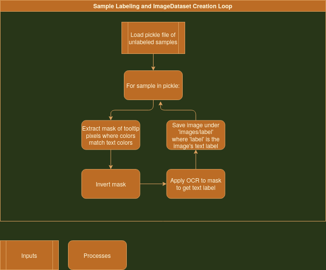

# Overview

This began as a collection of general tools which can be used to parse a live feed of a video game into into actionable intelligence. I was using Old School Runescape as the subject of testing.

This project is now focused on implementing real-time image segmentation to parse the play screen of OSRS. It will be trained on easily-obtainable training data.

The project is divided into three broad components

# Running the Code

Browse the `demos.py` file for a survey of the various implemented features.

# Implementation Details

## Data Collection/Preprocessing

First we collect triplets of (Mouse Position, Tooltip, 32x32 Screenshot centered on mouse)

Next we generate text labels for these triplets using OCR on the Tooltip. We also reformat the labeled data to be compatible with Torchvision's ImageFolder dataset

## Machine Learning Training

Once the training data is in the format of an ImageFolder dataset, it's pretty cut and dry to load up MobileNet and finetune the network using Pytorch.

## Real-time Screen Segmentation

This part is still under construction, but the procedure will be a loop kind of like this:

1) Screenshot the play screen
2) Divide playscreen into a grid of 32x32 regions
3) Classify each region
    - If this is too computationally intensive, I will implement some kind of interlacing, like only classifying every other block in each pass.
4) Display color-coded classifications
